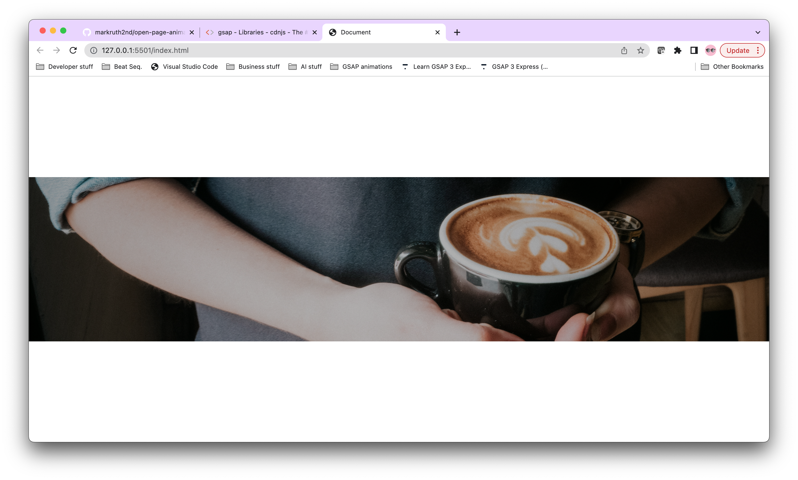

# open-page-animation
Animation of a page when you open it or refresh the page to create an interactive feel to it! Hope this doesn't give away my coffee addition☕️☕️😂

# Depoloyed Link
https://markruth2nd.github.io/open-page-animation/

INSTRUCTUONS OF USE: The see the animation in action, all you need to do is click the above link and if you looked away before seeing the ✨magic✨ happen, just refresh the page.

## Introduction & Features

The purpose of this project is to keep finding ways in which I can make web pages feel a bit more interactive for the user and what better way to do that than with a fresh ground cup of coffee(I think that coffee addiction is becoming a bit more prevelant🤣).

## Features

Using the GSAP library, specifically the TweenMax & TimelineMax features I have created an interactive feeling to the page as the user first opens the page which hopefully helps the user feel more welcome and get a true feeling of the purpose of the webpage.

# Sources
Coffee image has been taken from the pexels.com website.

The burger menu SVG for this project has been taken from svgrepo.com

GSAP Library scripts used:
  - TweenMax.min.js
  - TimelineMax.min.js

 
# Screenshots
The below is the begining of the anmimation:

The below is the end of the anmimation:
